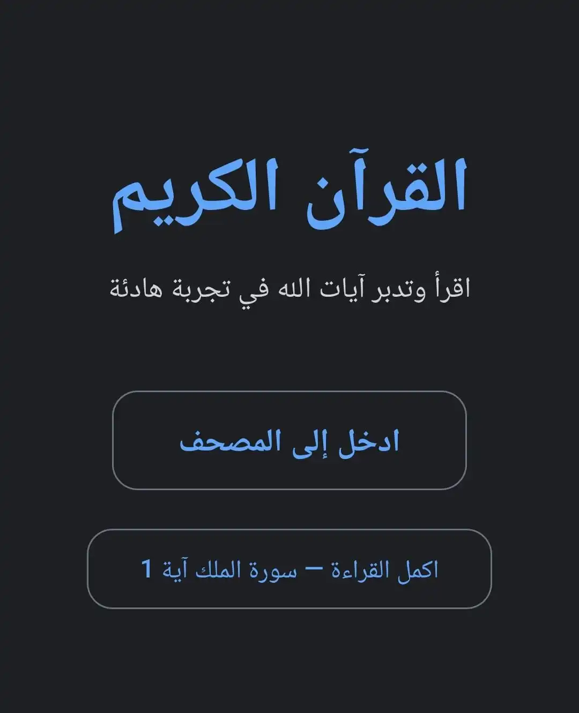

cat << 'EOF' > README.md
# Quran Kareem

A modern web application for reading the Holy Quran online with a clean interface and smooth navigation between Surahs.

## Live Demo
https://quran-kareem-ya-21.vercel.app

## Features

- Read all **114 Surahs** of the Holy Quran
- Clean and distraction-free reading experience
- Responsive design for mobile and desktop
- Automatic **last read position saving**
- Easy navigation between Surahs
- Smooth page transitions
- Dark reading environment for eye comfort

## Screenshots

Home Page

## Surah Navigation

Each Surah can be accessed using the following route format:

/surah/{number}

Examples

/surah/1  
/surah/36  
/surah/114  

## Tech Stack

Frontend

- React
- TypeScript
- Vite
- React Router
- Context API
- Tailwind CSS

Deployment

- Vercel

SEO

- Meta Tags
- Open Graph
- sitemap.xml
- robots.txt
- Google Search Console

## Project Structure

src
 ├─ components
 ├─ context
 ├─ pages
 ├─ data
 └─ main.tsx

public
 ├─ cover.png
 ├─ sitemap.xml
 └─ robots.txt

## Installation

Clone the repository

git clone https://github.com/Youssef-Atef-20/Quran-Kareem.git

Enter the project folder

cd Quran-Kareem

Install dependencies

npm install

Run development server

npm run dev

Build the project

npm run build

Preview production build

npm run preview

## Deployment

This project is deployed using **Vercel**.

To deploy manually:

npm run build

Then upload the dist folder to your hosting service.

## SEO

The website includes:

- Sitemap for all Surahs
- Robots configuration
- Meta tags for search engines
- Open Graph preview for social media

## Author

Youssef Atef

Software Engineering Student  
Alexandria University

GitHub  
https://github.com/Youssef-Atef-20

EOF